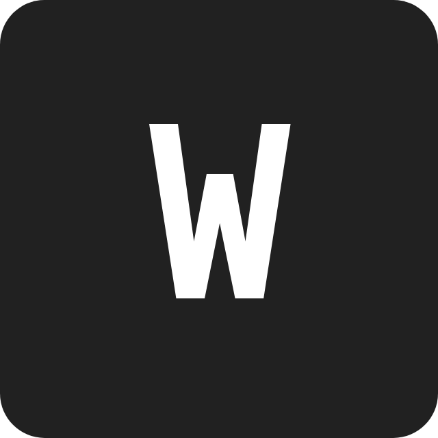

## Personal website
Wouter de Bruijn's personal website.
Built using create-react-app.

[https://wouterdb.nl](https://wouterdb.nl)

## Technology's

these are the web technology's used building my website

1. Netlify
2. React / create-react-app
3. gsap
4. Sass
5. Fontawesome / react-fortawesome

## todo V1.0

- [x] header about scroll icon gsap animated instead of css animated
- [x] responsive projects: resize smaller
- [x] project animtion bug: name goes down when the meta didn't animate out
- [x] footer
- [x] fix header icon scrolling
- [x] fix the scrolling to sections, it goes way too far
- [x] add darkmode / fix global variables to reflect the values and not these non suggestive ones
- [x] responsive footer
- [x] public folder structuring
- [x] fix that you can tab into the Projects section and the animation plays
---
- [ ] fix that you can tab into the <a> tags from react-scroll
- [ ] add a darkmode switch in the nav or somfn
- [ ] fix a trello for the todo
- [ ] in general give everything more space / mobile & desktop
- [ ] give the header scroll icon a hover animation
- [ ] responsive projects: always display icons and description
- [ ] fix margins on the about when on mobile / responsive < 900px
- [ ] 404 page
- [ ] projects page and expantion: only 6 projects on the homepage

